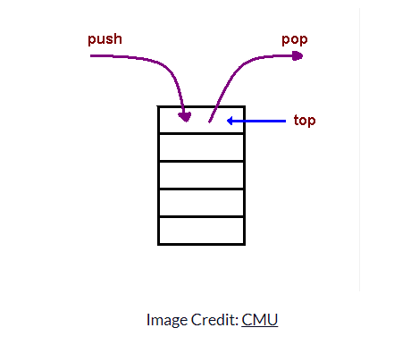

# The Call Stack

---

### Purpose of Node.JS

- Node is most often used to write web server code.
- Before Node, this used to be implemented in other _general purpose_ languages. (Python, Ruby, PHP, C++, etc.)

---

- Node was designed to be able to process many concurrent requests at the same time.
- This is done by running code in a single thread.
- It creates a separate thread for anything `In / Out`:
    - Read / write to disk.
    - Send / receive from the database.
    - Get user input from the keyboard.


---

_The separate threads are completely inaccessible to JavaScript._

- It allows JS to process requests, and offload much of the data processing to other servers/databases.
- To do all of this, Node makes use of **the call stack**.

---

### The Call Stack

- When calling a function, JS suspends the currently running code and "jump" to the code of the function.
- When a `return` statement is encountered, JS needs to know where to `return` to.
- JS keeps track of this in the call stack.

---

A stack is a data structure on which you can push items, and popping the stack will retrieve the last pushed item (LIFO, Last In, First Out)



---

```js
const firstFunction = () => {
    return "Hello from the first function!"
}

const secondFunction = () => {
    firstFunction();
}

const thirdFunction = () => {
    secondFunction();
}

console.log(thirdFunction());
```

---

JavaScript only has **one** call stack.

- Since the call stack uses up memory, you can sometimes get an error: `RangeError: Maximum call stack size exceeded`.
- This is expecially prevalent with recurcive functions.

```js
// Example (running this code is not recommended)
const callingMyself = () => {
    console.log("I am calling myself");
    callingMyself();
}

callingMyself();
```

---

### Blocking the call stack

Here is a typical request/response flow:

1. Receive a `fetch` request from a client.
2. Parse the `fetch` request to understand it.
3. Find out that the request is asking about the last 10 blog posts in our database.
4. Make a request to the database (over the network).
5. **Wait** for the database response to come back.
6. Parse the data and make it into an acceptable web format (HTML, JSON, XML).
7. Send the response to the client.

_Where is there a potential problem?_

---

#### The Node solution

- Any `In / Out` functions are made _asynchronous_.
- Node uses a separate _thread_ under its control to do the `In / Out`.
- The `In / Out` function will **not `return` anything**.
- Instead, the `In / Out` function will take an additional parameter, a callback.
- Node will register the callback function in its memory, and will call it back **later. When the database response comes back**.
- We say that Node will call the callback function **asynchronously**.

---

### The Asynchronous headache

- Since asynchronous functions return immediately, they don't have time to know if an error will occur.
- If any errors occur, they would be in the separate `In / Out` thread which is under Node's control.
- Among other things, this means that async errors can't bubble up the call stack because there is no call stack anymore when the data comes back (because they return immediately, which exists the call stack).

---

### Node solves this! (sort of)

- By convention, all async functions will accept a callback as their **last argument**.
- Async functions will call the provided callback _only once_.
- By convention, callbacks to async functions will always take an error parameter in the **first position**.
- Any "result" or "success" parameters will go afterwards.
- Callbacks to async functions must check if the error parameter is "set". Usually it will be an `Error` object, but anything truthy should be treated as an error.
- Effectively this means that asynchronous code using callbacks has to manually bubble errors up the asynchronous call "stack".

---

This creates code such as the following:

```js
// read the file "file.json"
fs.readFile("file.json", (err, val) => {
    // if error found
    if (err) {
        console.error("unable to read file");
    } 
    else {
        // parse the file from JSON to JS
        val = JSON.parse(val);
        console.log(val.success); 
    }
});
```

---

The previous code contains a mix of synchronous (`JSON.parse`) and asynchronous (`fs.readFile`) code, showing the two modes of operation:
`JSON.parse` returns its value synchronously. 

`fs.readFile` does not `return` anything! Instead, it accepts a callback function. When the disk access is done, Node calls the callback function and passes it the data. But because an error could have happened, and `throw` can't be used (no more call stack to catch it), the callback accepts an `err` as its first parameter. The callback handles the error by printing "unable to read file".

---

This mix of code styles has some drawbacks:

- It is confusing because we can't easily know if a function is sync or async.
- It forces us to manually bubble up errors.
- It forces us to create awkward functions that have parameters that are not theirs -- `callback` for the async functions, and `err` for the callback.
